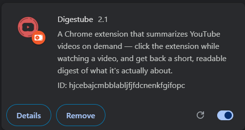
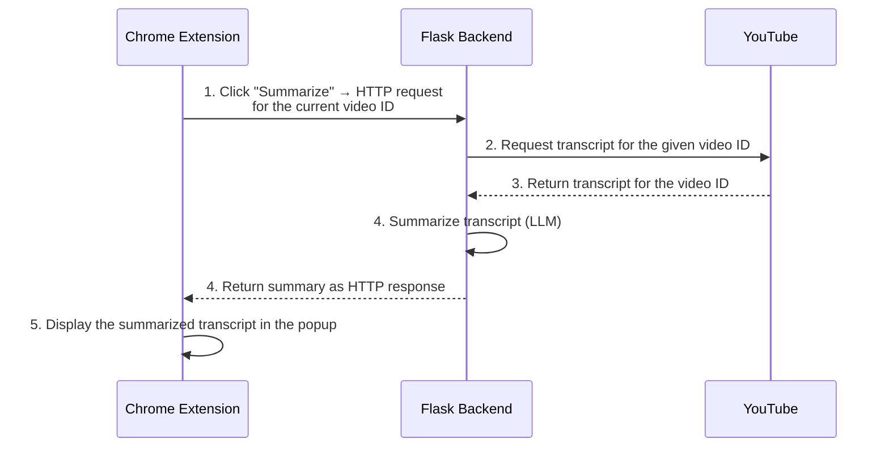

# Digestube

A Chrome extension that summarizes YouTube videos on demand — click the extension while watching a video, and get back a short, readable digest of what it's actually about.



## Project Context

An enormous number of video recordings are being created and shared on the internet throughout the day. It has become really difficult to spend time watching such videos, which may have a longer duration than expected, and sometimes our efforts may become futile if we couldn't find relevant information out of it. Summarizing transcripts of such videos automatically allows us to quickly look out for the important patterns in the video and helps us save time and effort compared to going through the whole content of the video.

## High-Level Approach

- Get transcripts/subtitles for a given YouTube video ID using a Python API.
- Perform text summarization on the obtained transcript using an LLM.
- Build a Flask backend REST API to expose the summarization service to the client.
- Develop a Chrome extension which utilizes the backend API to display the summarized text to the user.

## Request Flow



GitHub renders this diagram automatically wherever this README is viewed.

## How it works

- **Extension** (`manifest.json`, `popup.html`, `popup.css`, `popup.js`) — reads the active tab's video ID and calls a local Flask server.
- **Backend** (`app.py`) — fetches the video's transcript, sends it to Groq for summarization, and returns the summary as plain text.

## Setup

### 1. Backend

```bash
pip install flask flask-cors youtube-transcript-api groq
```

Set your [Groq API key](https://console.groq.com/keys) (free tier):

```bash
# Windows
set GROQ_API_KEY=your_key_here

# macOS / Linux
export GROQ_API_KEY=your_key_here
```

Run the server:

```bash
python app.py
```

It starts on `http://127.0.0.1:5000`.

### 2. Extension

1. Go to `chrome://extensions`.
2. Enable **Developer mode** (top right).
3. Click **Load unpacked** and select this project folder.
4. Make sure the backend (step 1) is running — the extension calls it directly.

## Usage

1. Open any YouTube video.
2. Click the Digestube icon in your toolbar.
3. Click **Summarize**.

## Tech Stack

- **Backend:** Flask, `youtube-transcript-api`, Groq SDK
- **Model:** `openai/gpt-oss-20b` via Groq (fast inference, free tier)
- **Extension:** Manifest V3, vanilla HTML/CSS/JS — no build step

## Notes

- The backend must be running locally for the extension to work — it's a local dev tool, not a hosted service.
- Some videos' captions are protected by YouTube in a way `youtube-transcript-api` can't always bypass (particularly auto-generated-only captions on certain videos). This surfaces as a clear error in the popup rather than a silent failure.
- Error details are logged server-side (Flask console) rather than shown in the UI, to keep the popup clean.

## License

Personal/portfolio project — no license specified.